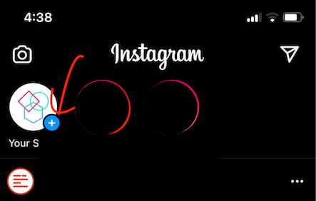
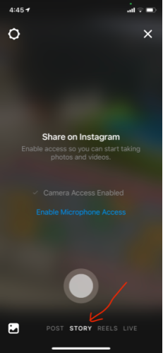
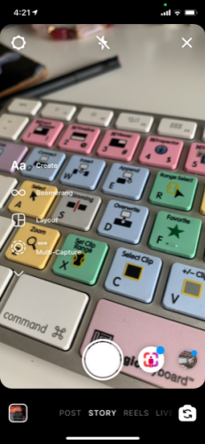
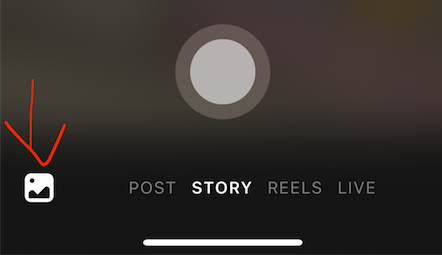
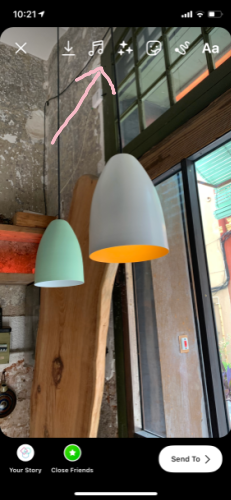

<h1>Instagram Documentation</h1>

<h2>Instagram Stories</h2>

Instagram stories are a way to share a collection of photos or videos with our followers. They only appear on our feed for 24 hours and then disappear. It's a great way to share content in real-time that we don't necessarily want to be permanent on our feed.

<h3>How to create a story</h3>

Click on the plus icon on the codebar profile picture.

Alternatively you can also swipe right from anywhere on your feed. This will take you to the live camera view. If you want sound in your story, you will need to enable microphone access.  

At the very bottom of the screen select the story button.

<h3>Adding new content</h3>

From here you can pick up your phone and start taking pictures or videos to add to your story. On the left hand side you will notice that there is a menu. You will only find this menu when shooting new videos or photos. There are many different settings that you can play around with. For example, the boomerang effect will take a burst of photos that will loop forward and backward.

 At the bottom next to the white button there is a series of icons which let you add all kinds of filters to your videos. Play around with those as well to see if there is anything that you like.  

Once you are happy with all of your edits, tap on the Your Story button on the bottom left hand corner and the image or video will get uploaded to your stories. To add more images or videos you will have to click on the plus icon on the codebar profile and repeat the process.    

<h3>Adding media from your camera roll.</h3>
If you prefer, you can select photos that you have already taken from your camera roll. To access your camera roll, you need to select the camera roll icon on the bottom left corner and enable photo access.

From here you can browse and look through the photos you want to add to your story. Once you are happy with the photos you want to share, you can add enhancements by using the tools offered at the top of the photo or video.

The first button with the arrow pointing down is to download the image. Next if you want to add music to your story select the music icon. The three little stars will let you add visual effect to your photos. Many of the effects are animations. The little happy face lets you add stickers, polls, quizzes, and other fun buttons. Once you select a sticker, you can rotate it, resize it, and if you drag it to the bottom of the screen, a little trash can appears and you can delete it.  

The little draw icon lets you draw on your picture, and finally the last button lets you add text over your image. Feel free to play around with the options until you are happy with the final version.

Once you are satisfied with all of your edits, tap on the Your Story button on the bottom left hand corner and the image or video will get uploaded to our stories and those following codebar bcn will be able to see your wonderful creation in their feeds. To add more images or videos you will have to swipe right, or tap on the plus icon on the codebar profile picture and repeat the process.   

<h2>Instagram Reels </h2>
Reels focus more on short video clips and they stay on your instagram account. One of the benefits of reels is that they make our content discoverable by other Instagram users who are not necessarily following the codebar instagram account. Reels let you record or edit clips for a video that can be 30 seconds long. You can also apply effects and music to the video.

Some people use reels to create short instructional videos.  

<h3>How to create a reel </h3>

To create a reel, swipe right and at the bottom you will see the reels button next to the story button. Once you tap on the reels button you will see the editing tools that you can use to customize the look and feel of the video. The top icon will let you shoot a 15 or 30 second video. After that you will see the music icon which lets you search and add music from the instagram audio library. Below this you will see the 1x icon, which allows you to create a slow motion or speeding up effect when recording. Below that you will see a happy face, which allows you to select an assortment of effects. You can apply effect to each individual video clip that makes up your reel. Below that is the touch up button which smooths out your skin. The bottom icon is the timer, which lets you specify how long you want to record for. You can go all the way up to the full 15 or 30 seconds if that is the length that you selected.

